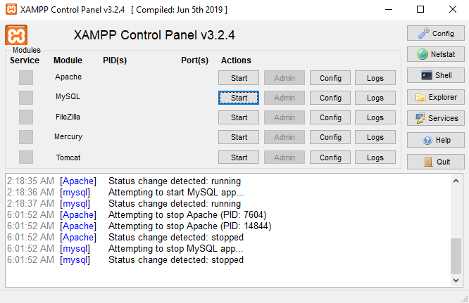
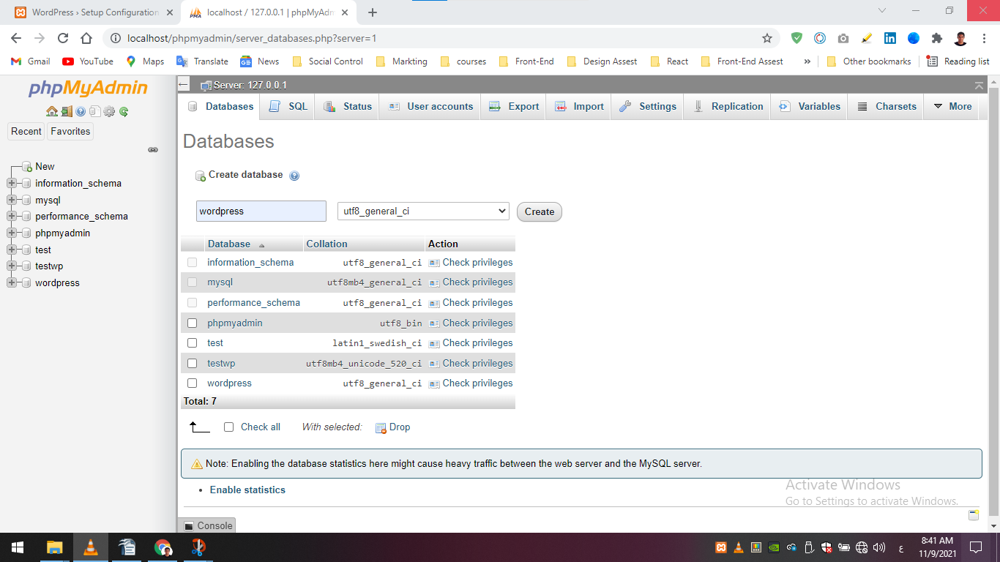

# 04 Setup WordPress on Localhost

1. [Setup Xampp](04-setup-wordpress-on-localhost.md#1.-setup-xampp)
2. [Localhost](04-setup-wordpress-on-localhost.md#2.-localhost)
3. [Setup WordPress](04-setup-wordpress-on-localhost.md#3.-setup-wordpress)
4. [Database](04-setup-wordpress-on-localhost.md#4.-database)

Localhost على الـ WordPress للـ Setup بأن إحنا نعمل WordPress هنبدأ مع بعض اول الخطوات العميقة فى الـ

Web Server ويكون عندى Localhostعلشان يتم موضوع الـ

محتاجين برنامج يسطب لنا الـ PHP و الـ Server والـ Database

<mark style="color:blue;">****</mark>

* <mark style="color:blue;">**دى مجموعة من البرامج اللى هتسطب لى الـ PHP  و Database هنختار واحد بس**</mark>

<mark style="color:blue;">****</mark>

<mark style="color:blue;">**Lamp**</mark>   : ****&#x20;

* Linux ** **<mark style="color:blue;">**+**</mark>** ** Apache <mark style="color:blue;">**+**</mark>  MySql <mark style="color:blue;">**+**</mark>  PHP

<mark style="color:blue;">**MAMP**</mark> :&#x20;

* Mac <mark style="color:blue;">**+**</mark>  Apache <mark style="color:blue;">**+**</mark>  MySql <mark style="color:blue;">**+**</mark>  PHP

<mark style="color:blue;">**WAPM**</mark> :&#x20;

* Windows <mark style="color:blue;">**+**</mark> Apache <mark style="color:blue;">**+**</mark> MySql <mark style="color:blue;">**+**</mark> PHP

<mark style="color:blue;">**XAMPP**</mark> :&#x20;

* All OS <mark style="color:blue;">**+**</mark> Apache <mark style="color:blue;">**+**</mark>  MariaDB <mark style="color:blue;">**+**</mark> PHP <mark style="color:blue;">**+**</mark> PERL &#x20;

## <mark style="color:blue;">**1. Setup Xampp**</mark>


**تقدر تحملة من هُنا** [**https://www.apachefriends.org/download.html**](https://www.apachefriends.org/download.html)****


> Mysql و Apache للـ Start اضغط على Setup بعد ما عملت
>
> localhostعشان تبدأ تشتغل عليهم هتدخل على مسار الـ

## <mark style="color:blue;">2. Localhost</mark>

* localhostعشان تبدأ تشتغل عليهم هتدخل على مسار الـ
* Browser يعنى لما نيجى نفتح الـ localhost المسار دا كلة يعتبر الـ C:\xampp\htdocsدا المسار

> localhost هنكتب كلمة


Hyper Text Document الـكلمـة دي إختصار htdocs&#x20;


لو مثلاً داخل المسار دا  C:\xampp\htdocs عملت Folder إسمة Create تقدرت تدخل علية من الـBrowser بالشكل دا&#x20;


localhost/create كدا folder بنضيف إسم الـ localhost بعد كلمة


## <mark style="color:blue;">3. Setup WordPress</mark>


htdocsالـ folder داخل wordpress الـ folderأول حاجه هنعملها هنضيف



localhost/wordpress ونكتب browser تانى حاجه هنعملها هنفتح الـ


let's go! أضغط على

## <mark style="color:blue;">4. Database</mark>

* phpmyadmin هنعملها داخل الـ


localhost/phpmyadmin


* <mark style="color:blue;">**wordpress**</mark> وهنسميها <mark style="color:blue;">**database**</mark> هننشأ
* دا الترميز العالمى اللى مش هيعملك مشاكل <mark style="color:blue;">**utf8\_general\_ci**</mark>&#x20;

&#x20; خامس حاجة هنروح نكمل خطوات الـwordpress بالشكل دا

* Database Host: localhost
* Username : root&#x20;
* Database Name : Wordpress

*   هيطلب منك شوية بيانات بعد ما عملنا instalation

    * إسم الموقع&#x20;
    * log in إسم المستخدم هتحتاجة لما تعمل
    * log in كلمة المرور هتحتاجة برضو لما تعمل
    * الإيميل هتحتاجة لو حصل مشكلة او نسيت إسم المستخدم و الباسورد عشان ترجعة

.png>)

